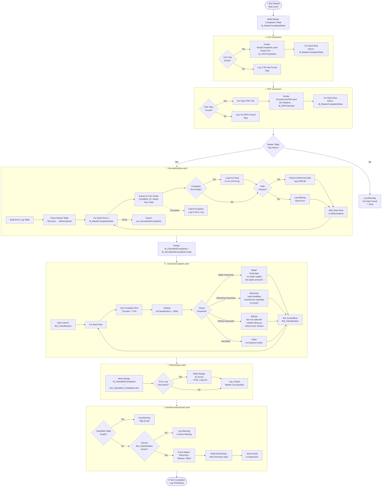
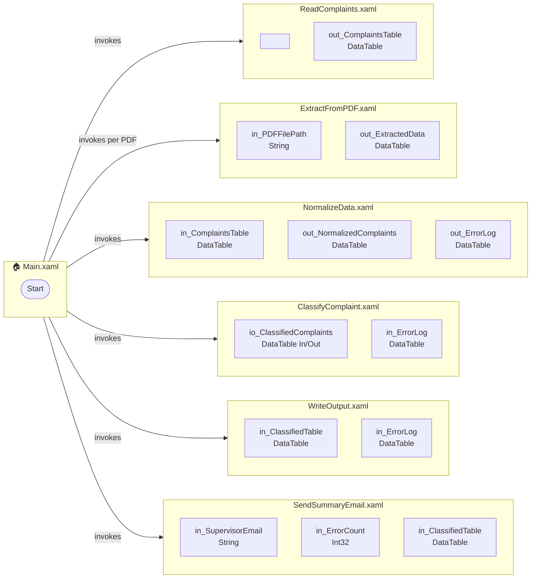

# 🗺️ Workflow Map — PM04-PS05 Municipal Complaint Automation Bot

> **Tip:** To render this diagram, open this file in **VS Code** with the
> [Markdown Preview Mermaid Support](https://marketplace.visualstudio.com/items?itemName=bierner.markdown-mermaid)
> extension, or paste the code block into [https://mermaid.live](https://mermaid.live)

---

## 🔁 Full Process Flow

---

## 📦 Sub-Workflow Inputs & Outputs

---

## 🗂️ Data Tables Reference

| Variable | Type | Created In | Used In |
|---|---|---|---|
| `dt_MasterComplaintsRaw` | DataTable | Main.xaml | NormalizeData |
| `dt_CSVComplaints` | DataTable | ReadComplaints | Main.xaml |
| `dt_PDFExtracted` | DataTable | ExtractFromPDF | Main.xaml |
| `dt_NormalizedComplaints` | DataTable | NormalizeData | Main.xaml |
| `dt_ClassifiedComplaints` | DataTable | Main.xaml (copy) | ClassifyComplaint, WriteOutput, SendSummaryEmail |
| `dt_Errors` | DataTable | NormalizeData | WriteOutput, SendSummaryEmail |

---

## 🏷️ Classification Keywords Reference

| Category | Keywords |
|---|---|
| 💧 Water | `burst pipe`, `no water supply`, `low water pressure` |
| ⚡ Electricity | `load shedding`, `transformer exploded`, `no power` |
| 🗑️ Refuse | `bin not collected`, `rubbish piling up`, `refuse truck missed` |
| ❓ Other | *(anything that does not match the above)* |

---

*Generated: 2026/04/21 | Project: PM04-PS05 — Municipal Complaint Automation Bot*
